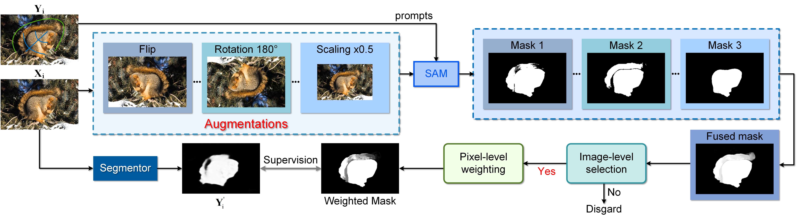

# WS-SAM
**Weakly-Supervised Concealed Object Segmentation with SAM-based Pseudo Labeling and Multi-scale Feature Grouping**, NeurIPS 2023

[[Paper](https://proceedings.neurips.cc/paper_files/paper/2023/file/61aa557643ae8709b6a4f41140b2234a-Paper-Conference.pdf)] [[Supplementary material](https://proceedings.neurips.cc/paper_files/paper/2023/file/61aa557643ae8709b6a4f41140b2234a-Supplemental-Conference.pdf)][Results] [Pretrained models]

#### Authors
[Chunming He^](https://chunminghe.github.io/), [Kai Li^](http://kailigo.github.io/), [Yachao Zhang](https://yachao-zhang.github.io/), [Guoxia Xu](https://scholar.google.com/citations?user=tfwlUZkAAAAJ&hl=en), [Longxiang Tang](https://scholar.google.com/citations?user=3oMQsq8AAAAJ&hl=en), [Yulun Zhang](https://yulunzhang.com/), [Zhenhua Guo](https://scholar.google.com/citations?user=dbR6bD0AAAAJ&hl=en), [Xiu Li*](https://scholar.google.com/citations?user=Xrh1OIUAAAAJ&hl=en)

---
> **Abstract:** *Camouflaged object detection (COD) aims to address the tough issue of identifying camouflaged objects visually blended into the surrounding backgrounds. COD is a challenging task due to the intrinsic similarity of camouflaged objects with the background, as well as their ambiguous boundaries. Existing approaches to this problem have developed various techniques to mimic the human visual system. Albeit effective in many cases, these methods still struggle when camouflaged objects are so deceptive to the vision system. In this paper, we propose the FEature Decomposition and Edge Reconstruction (FEDER) model for COD. The FEDER model addresses the intrinsic similarity of foreground and background by decomposing the features into different frequency bands using learnable wavelets. It then focuses on the most informative bands to mine subtle cues that differentiate foreground and background. To achieve this, a frequency attention module and a guidance-based feature aggregation module are developed. To combat the ambiguous boundary problem, we propose to learn an auxiliary edge reconstruction task alongside the COD task. We design an ordinary differential equation-inspired edge reconstruction module that generates exact edges. By learning the auxiliary task in conjunction with the COD task, the FEDER model can generate precise prediction maps with accurate object boundaries. Experiments show that our FEDER model significantly outperforms state-of-the-art methods with cheaper computational and memory costs.*
>
> <p align="center">
> 
> </p>
---

### 1. Prerequisites

> Note that WS-SAM is only tested on Ubuntu OS with the following environments.

- Creating a virtual environment in the terminal: `conda create -n FEDER python=3.8`.
- Installing necessary packages: `pip install -r requirements.txt`

### 2. Downloading Training and Testing Datasets

- Download the [training pseudo mask](https://pan.baidu.com/s/1OXQdRLhP3kond_vWWQLVIQ?pwd=6666), where the extraction code is 6666. We provide all pseudo masks to ensure completeness. Feel free to filter out those low-quality masks in the training phase.

- You can find useful training and testing datasets in [this repository](https://github.com/ChunmingHe/awesome-concealed-object-segmentation).


## Related Works
[Strategic preys make acute predators: Enhancing camouflaged object detectors by generating camouflaged objects](https://github.com/ChunmingHe/Camouflageator), ICLR 2024.

[Camouflaged object detection with feature decomposition and edge reconstruction](https://github.com/ChunmingHe/FEDER), NeurIPS 2023.

[Concealed Object Detection](https://github.com/GewelsJI/SINet-V2), TPAMI 2022.


## 📎 Citation

If you find the code helpful in your research or work, please cite the following paper(s).

```
@article{he2023weaklysupervised,
  title={Weakly-Supervised Concealed Object Segmentation with SAM-based Pseudo Labeling and Multi-scale Feature Grouping},
  author={He, Chunming and Li, Kai and Zhang, Yachao and Xu, Guoxia and Tang, Longxiang and Zhang, Yulun and Guo, Zhenhua and Li, Xiu},
  journal={NeurIPS},
  year={2023}
}
```
## Concat
If you have any questions, please feel free to contact me via email at chunminghe19990224@gmail.com or hcm21@mails.tsinghua.edu.cn.

## 💡 Acknowledgements
The codes are based on [FEDER](https://github.com/ChunmingHe/FEDER) and [SINet V2](https://github.com/GewelsJI/SINet-V2). Please also follow their licenses. Thanks for the awesome work.

